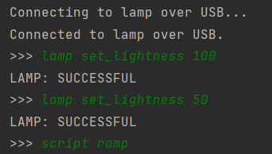
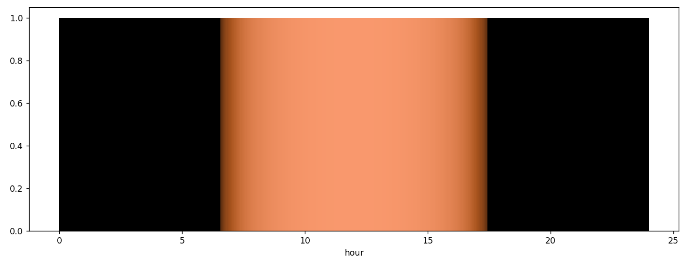

# HDLC Sun Lamp
This repository contains the firmware for a sun lamp that communicates with a desktop Python Command-Line Interface (CLI) using the High-level Data Link Control (HDLC) protocol.

## HDLC protocol

The serial communication with the desktop CLI uses the HDLC protocol which introduces packets with a preamble and a checksum. The packet's body contains commands with arguments that control the lamp's intensity and get the GNSS data.

## Sun Lamp Function

Sun lamp means that the lamp's color and intensity varies with time of day according to the sun's state. The lamp uses a GNSS receiver and a real-time clock to keep track of time of day.
